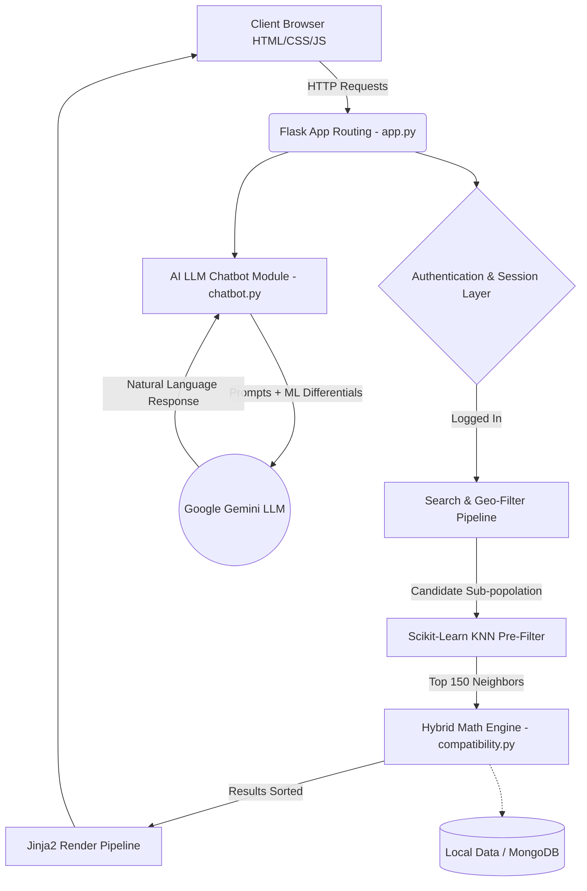

# 🏠 CohabitAI: Advanced Machine Learning Roommate & PG Allocation Platform

## 📖 1. Project Overview & Product Vision
**CohabitAI** is a state-of-the-art, data-driven platform designed to reinvent the process of finding compatible roommates and Paying Guest (PG) accommodations. Moving beyond rudimentary filters like "budget" and "location", CohabitAI leverages a **multidimensional mathematical compatibility engine** built on proven sociological dimensions.

By modeling users along critical lifestyle habits, personality traits, and strict behavioral constraints, the system ensures high-longevity matches. To assist users in this process, CohabitAI features an integrated AI Conversational Guidance Counselor, built on the Google Gemini API, capable of offering conflict resolution pathways mapped directly to the mathematical friction points between users.

### Core Value Propositions:
*   **Predictive Harmony:** Reduces mid-lease roommate conflicts by structurally aligning core habits (Cleanliness, Sleep Schedules, Noise Tolerance) before move-in.
*   **Transparent Analytics:** Provides users a "Peek under the hood" via the Compare Tool, specifically articulating *why* someone is a 95% match or a 60% match.
*   **Geo-Spatial Intelligence:** Fast Haversine filtering ensures users aren't shown perfect matches who live 500km away unless explicitly requested.
*   **LLM-Augmented Mediation:** A context-aware chatbot that acts as a pre-leasing mediator.

---

## 🏗️ 2. Architectural Design & Pipeline

### System Architecture Topology
CohabitAI relies on a decoupled Service-Layer architecture, strictly isolating the heavy Machine Learning computational mathematics from the fast HTTP routing endpoints. 

### Module by Module Workflow
1.  **Onboarding & Vectorization:** Users answer a 10-point Likert Scale (1-5) questionnaire. This raw data is mapped to a Numpy Array (Feature Vector) in real-time.
2.  **Pre-Calculation Filtering (Hard Constraints):** To save O(N^2) mathematical overhead, candidate pools are aggressively truncated using Haversine distance, budget barriers, smoking limits, and gender prerequisites. 
3.  **KNN Dimensionality Slicing (Scalability Trigger):** Once the candidate pool scales beyond 250 records, a Scikit-Learn `NearestNeighbors` (Metric: Cosine) index fits over the active pool, dumping the furthest candidates instantly.
4.  **Hybrid Core Blender:**
    *   `compute_weighted_cosine_similarity()` handles proportional alignment.
    *   `compute_weighted_euclidean_similarity()` handles magnitude variance.
    *   `compute_bio_similarity()` applies TF-IDF on user text.
    *   Scores are statically weighted and reduced to a `0-100%` human-readable score.
5.  **GenAI Context Bridge:** The `chatbot.py` extracts the raw output of `compute_feature_differential()` and constructs engineered NLP Prompts dictating exactly how two users differ, feeding formatting rules to the Gemini LLM for resolution advice.

---

## 🧮 3. Core Mathematical Concepts & Formulas

The ML Engine (`compatibility.py`) operates as the brain. The algorithm treats each user as a point in a 10-dimensional space. 

**Definition of Space:**
*   **Feature Vector ($A$):** $A = [l_1, l_2, ... l_{10}]$ (Normalized from 1 to 5)
*   **Weight Vector ($W$):** $W = [w_1, w_2, ... w_{10}]$

### A. Weighted Cosine Similarity (60% Weight in Final Score)
Standard Cosine Similarity determines the angle between two vectors. By scaling the inputs via the Weight Vector ($W$), the model heavily penalizes divergent angles on critical dimensions (e.g., Cleanliness).

$$S_c(A, B) = \frac{\sum_{i=1}^{n} (w_i \cdot A_i \cdot B_i)}{\sqrt{\sum_{i=1}^{n} (w_i \cdot A_i^2)} \cdot \sqrt{\sum_{i=1}^{n} (w_i \cdot B_i^2)}} \times 100$$

*   **Logic:** Proves proportional alignment. If User A prefers "3" across the board and User B prefers "4", they are highly compatible proportionally, just with differing intensities.

### B. Weighted Euclidean Similarity (25% Weight in Final Score)
Euclidean measures the absolute straight-line distance. Used to catch what Cosine misses (e.g., the intensity jump between a clean freak "5" and a slob "1").

1.  **Calculate Weighted Straight-Line Distance:**
    $$D_e(A,B) = \sqrt{\sum_{i=1}^{n} w_i \cdot (A_i - B_i)^2}$$
2.  **Calculate Max Possible Distance Matrix:** (Knowing ranges are fixed 1 to 5)
    $$D_{max} = \sqrt{\sum_{i=1}^{n} w_i \cdot (4)^2}$$
3.  **Normalize to Compatibility %:**
    $$S_e(A,B) = \left( 1 - \frac{D_e(A,B)}{D_{max}} \right) \times 100$$

### C. Text/Bio Similarity (15% Weight in Final Score)
Converts raw string biographies into frequency matrices to find latent shared hobbies or linguistic styles.

$$M = \text{TF-IDF}(Bio_A, Bio_B)$$
$$S_b(A, B) = \text{Cosine}(M_A, M_B) \times 100$$

### D. Final Hybrid Score Blending
The algorithm fuses the respective models to create a highly robust output impervious to missing text variables or edge-case single-score anomalies.

$$\text{Final Compatibility} = (0.60 \times S_c) + (0.25 \times S_e) + (0.15 \times S_b)$$

### E. Haversine Formula (Geo-Spatial Routing)
Calculating pure spherical distance on Earth's curvature before rendering maps or filtering searches.

$$a = \sin^2\left(\frac{Lat_2 - Lat_1}{2}\right) + \cos(Lat_1) \cdot \cos(Lat_2) \cdot \sin^2\left(\frac{Lon_2 - Lon_1}{2}\right)$$
$$c = 2 \cdot \text{atan2}(\sqrt{a}, \sqrt{1-a})$$
$$D_{km} = 6371 \times c$$

### F. Conflict Differential (The "Compare" Logic)
The engine highlights exact friction zones by calculating the absolute scaled differential for every dimension. 

$$\Delta_i = w_i \cdot |A_i - B_i|$$

The engine sorts the differences descending. The top variables form the "Conflicts", the bottom form the "Overlaps".

---

## 🧬 4. Dimensional Feature Weights
CohabitAI relies on sociological data to dictate importance. The $W$ array is defined as:

| Dimension Factor | Weight ($w_i$) | Risk Factor if Clashed |
| :--- | :--- | :--- |
| **`sleep_schedule`** | **5.0** | 🔥 High (Daily disruption) |
| **`cleanliness`** | **5.0** | 🔥 High (Primary cause of disputes) |
| **`noise_tolerance`** | **4.5** | ⚠️ Medium-High |
| **`social_battery`** | **4.0** | ⚠️ Medium-High |
| **`introversion_extroversion`** | **4.0** | ⚠️ Medium-High |
| **`communication_style`** | **3.5** | 🟡 Medium |
| **`guest_frequency`** | **3.5** | 🟡 Medium |
| **`conflict_resolution`** | **3.0** | 🟡 Medium |
| **`cooking_frequency`** | **2.0** | 🟢 Low-Medium |
| **`workout_habit`** | **1.5** | 🟢 Low (Bonus Alignment) |

---

## 🛠️ 5. Technical Stack & Implementation

*   **Logic Runtime:** `Python 3.10+` running the `Flask 3.x` framework. Safe, multi-threaded request routing.
*   **Vector Operations:** `NumPy` executing matrix arrays to ensure scaling thousands of vectors takes fractions of a second.
*   **Machine Learning Tooling:** `scikit-learn` handling all Text Vectorization, KNN neighbor grouping, and PCA (Principal Component Analysis).
*   **Data Layer:** Phase 1 uses robust threading-locked JSON flat-files (`users_local_balanced.json`). Phase 2 uses `PyMongo` to map documents directly into MongoDB Atlas.
*   **Generative AI:** Google Gemini LLM SDK processing zero-shot conflict mediation prompts heavily engineered by the backend before API transmission.
*   **View Layer:** HTML5/CSS3 relying on native Jinja2 Context injection. Implements a fully bespoke "Glassmorphism" UI paradigm.

---

## 🚀 6. Developer Workflows & Execution Path

### How the system executes a match query:

1.  **Application Boot Phase (`app.py`)**: 
    The Flask engine boots. `_USERS_LOCK` initiates to handle concurrent read/writes on the JSON.
2.  **User State Serialization**: 
    The active user object is pulled from the Flask-Login session. Their Likert answers are rapidly serialized into `np.array`.
3.  **Search & Dash Execution Generator**: 
    *   `get_all_active_users()` compiles the global array.
    *   `check_hard_constraints(user, candidates)` loops through and removes constraints (e.g., Non-smoker wanting non-smoker).
    *   Valid subset array is passed into `rank_users_by_compatibility(...)`.
4.  **Math Engine Invocation**: 
    *   If Candidate Pool > 250: Sklearn `NearestNeighbors` groups the closest vector arrays.
    *   System runs the custom Hybrid Blending formulas for every remaining viable candidate.
    *   The `score` and `distance` are attached to temporary DTO objects and `.sort(reverse=True)` is called.
5.  **LLM Execution via Compare Mod**:
    *   Upon clicking "Compare", `compute_feature_differential(userA, userB)` creates a json dict of $\Delta_i$.
    *   `chatbot.py` observes $\Delta_i$, identifies the key dimensions failing, injects the static system prompt mapped to that dimension into Gemini, and pushes the text to the websocket/HTTP response for the user to read.
